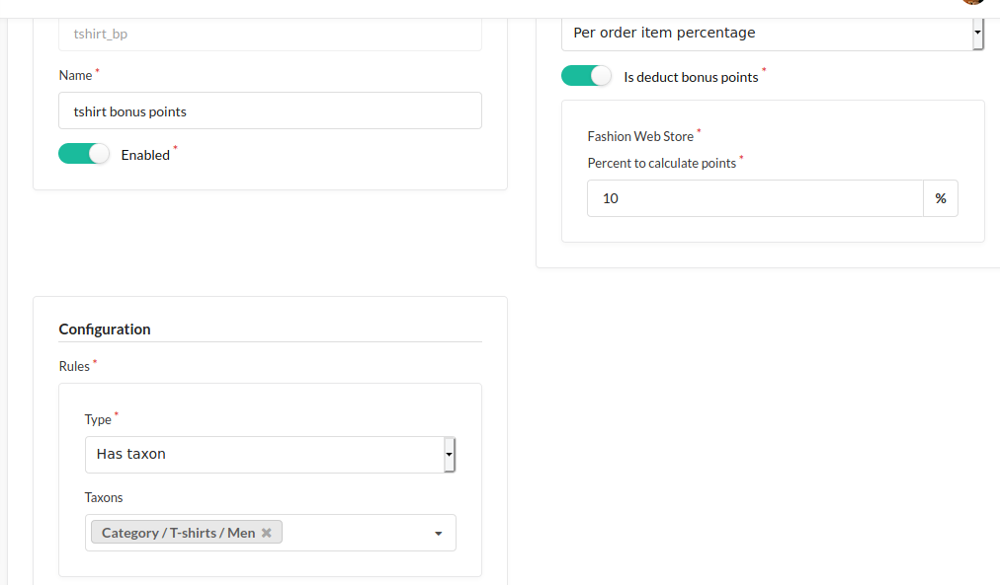
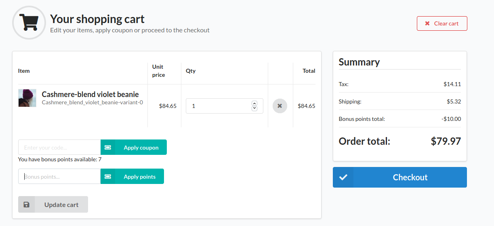
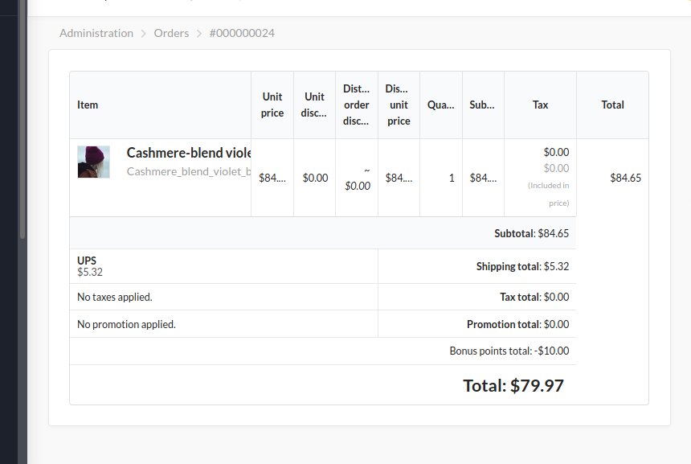

<h1 align="center">
    <a href="http://bitbag.shop" target="_blank">
        
    </a>
    <br />
    <a href="https://packagist.org/packages/bitbag/bonus-points-plugin" title="License" target="_blank">
        
    </a>
    <a href="https://packagist.org/packages/bitbag/bonus-points-plugin" title="Total Downloads" target="_blank">
        
    </a>
    <p>
        <a href="https://sylius.com/plugins/" target="_blank">
            
        </a>
    </p>
</h1>

## About us

At BitBag we do believe in open source. However, we are able to do it just because of our awesome clients, who are kind enough to share some parts of our work with the community. Therefore, if you feel like there is a possibility for us working together, feel free to reach us out. You will find out more about our professional services, technologies and contact details at https://bitbag.io/.

## Screenshots








## Overview

This plugin allows you to create rules for assigning bonus points to users.<br />
Users can exchange them for discounts(1 bonus point = 1 currency discount) when creating an order.

## Installation

1. Require plugin with composer:

    ```bash
    composer require bitbag/bonus-points-plugin
    ```
 
1. Add plugin dependencies to your `config/bundles.php` file:
    
    ```php
        return [
         ...
        
            BitBag\SyliusBonusPointsPlugin\BitBagSyliusBonusPointsPlugin::class => ['all' => true],
        ];
    ```

1. Import required config by adding  `config/packages/bitbag_sylius_bonus_points_plugin.yaml` file:
    
    ```yaml
    # config/packages/bitbag_sylius_bonus_points_plugin.yaml
    
    imports:
       - { resource: "@BitBagSyliusBonusPointsPlugin/Resources/config/config.yml" }
    ```    

1. Import routing in your `config/routes.yaml` file:
    
    ```yaml
    
    # config/routes.yaml
    ...
    
    bitbag_sylius_bonus_points_plugin:
        resource: "@BitBagSyliusBonusPointsPlugin/Resources/config/routing.yml"
    ```

1. Extend `Order`(including Doctrine mapping):

    ```php
    <?php 
   
   declare(strict_types=1);
    
    namespace App\Entity\Order;
    
    use BitBag\SyliusBonusPointsPlugin\Entity\BonusPointsAwareInterface;
    use BitBag\SyliusBonusPointsPlugin\Entity\BonusPointsAwareTrait;
    use Sylius\Component\Core\Model\Order as BaseOrder;

    class Order extends BaseOrder implements BonusPointsAwareInterface
    {
        use BonusPointsAwareTrait;
    }
    ```
   
   Mapping (XML):
   
   ```xml
   <?xml version="1.0" encoding="UTF-8"?>
   <doctrine-mapping xmlns="http://doctrine-project.org/schemas/orm/doctrine-mapping"
                     xmlns:xsi="http://www.w3.org/2001/XMLSchema-instance"
                     xsi:schemaLocation="http://doctrine-project.org/schemas/orm/doctrine-mapping
                                         http://doctrine-project.org/schemas/orm/doctrine-mapping.xsd"
   >
         <entity repository-class="App\Doctrine\ORM\OrderRepository" name="App\Entity\Order\Order" table="sylius_order">
               <field name="bonusPoints" type="integer" nullable="true" />
         </entity>
   </doctrine-mapping>
   ```

1. Customize shop templates to include bonus points. For starter You may want copy to templates directory everything from plugin's tests/Application/templates
   
1. Finish the installation by updating the database schema and installing assets:

    ```
    $ bin/console doctrine:migrations:diff
    $ bin/console doctrine:migrations:migrate
    ```

## Testing
```bash
$ composer install
$ cd tests/Application
$ yarn install
$ yarn build
$ bin/console assets:install public -e test
$ bin/console doctrine:schema:create -e test
$ bin/console server:run 127.0.0.1:8080 -d public -e test
$ open http://localhost:8080
$ vendor/bin/behat
```

## Contribution

Learn more about our contribution workflow on http://docs.sylius.org/en/latest/contributing/.
