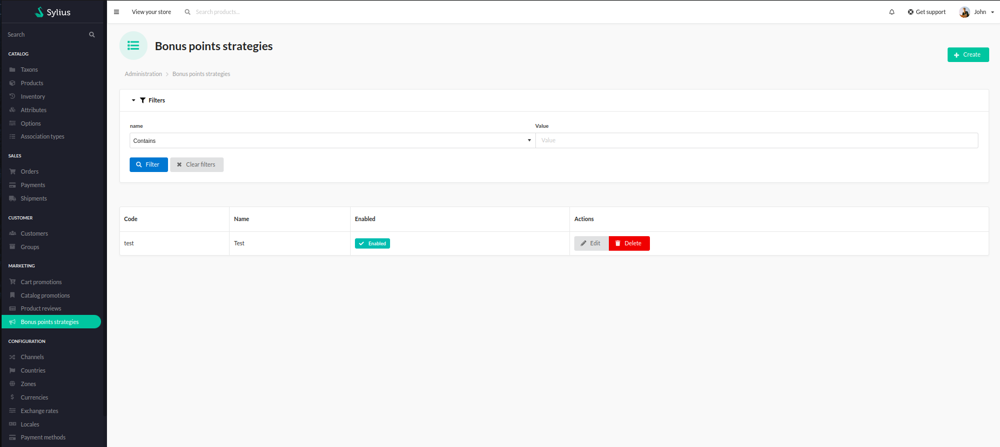

# Functionalities

---

This plugin allows you to create rules for assigning bonus points to users.
Users can exchange them for discounts(1 bonus point = 1 currency discount) when creating an order.

After an installation, the user has access to the "Bonus points strategies" section.

    

Users can then create their own bonus points strategies through a special configuration form. 

    

It is possible to set the name and code for the strategy, rules for how the points should be awarded and specify taxons that allow the user to gain new points.

When acquired, points can be used at the cart stage.

    

Customer can decide how many points they want to use. After the decision, the discount is applied immediately.

    

Discount is also mentioned in the order summary, so the admin can check if everything was applied correctly. 
